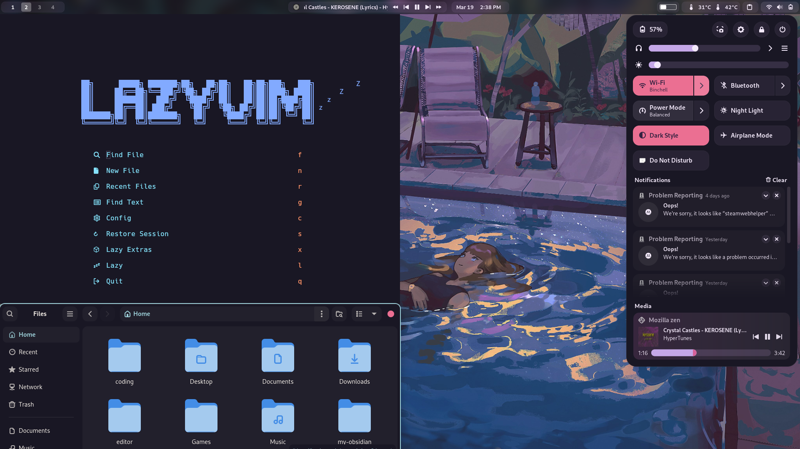

# My GNOME Settings

1. Move configuration folders (e.g., kitty and neovim) to the `~/.config` directory.
2. Move `Rosepine-Dark` theme to the `~/.themes` directory and you can apply the themes using `gnome tweaks`. You can create it if you don't have it.
3. Install all extension. You can find the list in the `list-extensions.png` image.
4. Load the extension settings with the following command: 
- `dconf load /org/gnome/shell/extensions/ < extensio-settings.txt`
5. Move `fonts` folder to the `~/.local/share` directory.
6. Move `BreezeX` cursor to the `~/.local/share/icons` directory.

